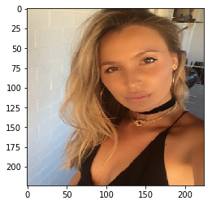

# Contents

# Problem Statement

Knowing if a face has been digitally enhanced can be difficult in today’s tech-driven world, creating a spectrum of problems that ranges from fake-news to social-media-fueled mental illness. Here, we develop a classification model to predict if a face has been digitally enhanced, whether it be touch-ups, facial part replacements (i.e nose, eyes,etc.) or shape-correcting touches (i.e. straightening teeth, changing nose size).

# Executive Summary

**Data**

The images of non-photoshopped faces were obtained from the [FEI Face Database](https://fei.edu.br/~cet/facedatabase.html), and it includes 1400 pictures (100 individuals, half female, half male). Different images of the same individual are contained within each modeling set (training, validation and testing sets).

The images of photoshopped faces were compiled from several datasets in order to include different types of enhancements. The first dataset is the [Real and Fake Face Detection Data](https://www.kaggle.com/ciplab/real-and-fake-face-detection/data), where faces are constructed using individual pieces from several faces (faces that people labeled as ‘easy to recognize it is photoshopped’ were excluded). Next, we included images from a Google search of Facetune, since this is the most popular face-editing app used by influencers on social media as well as some celebrities. Both of these photoshopped-face sets together are a total of 779 images, where each individual is unique.

**Models**

Convolutional Neural Networks (CNN) were developed to make this classification. We were able to achieve 100% accuracy by removing the presence of a pooling layer, at the cost of creating a slow model.In turn, we created a second model where a pooling layer was incorporated. It was 6 times faster and had an accuracy of 99%. 

Using the original model, we tested in both RGB and Grayscale to ensure the CNN was not relying solely on color and light but rather the shape of the face. This was necessary because the dataset did not include non-enhanced images with studio lightning (these couldn't be found in large quantities). 100% accuracy was reached again, showing that the model may benefit from color but does not rely on it.

# Sample Images
- *Sample Non-Enhanced Individual*
 

- *Sample Fake Faces*

                    
        

- *Sample Facetuned Faces*

        

# Model 1 Evaluation

Model 1 was 100% accurate. As mentioned before, we excluded the pooling layer.  The reasoning behind this was that the "skin-bluring" effect that is almost always present in enhanced faces and pooling layers both average pixels, undermining the presence of this type of facial edit. 

Below, we can see how the loss and the accuracy fluctuated during training and the confusion matrix for the testing set.

    
    

##### Click on the figure for zooming in or out and other interactive features

        

## Black and White Test Results

           

## Saliency Check

           

# Model 2 Evaluation

Here, we have a 99% accurate model with 1 false negative.

    

##### Click on the figure for zooming in or out and other interactive features

         

# Conclusion

# Recomendations