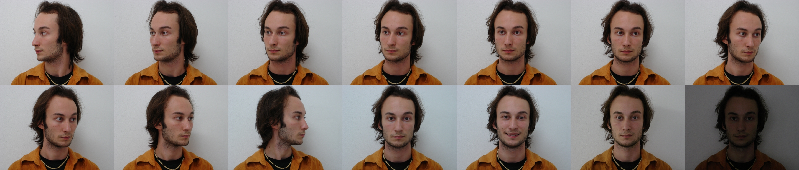
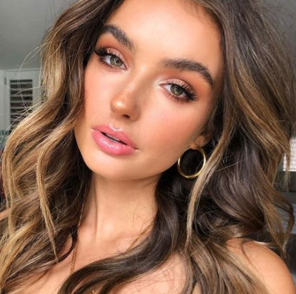
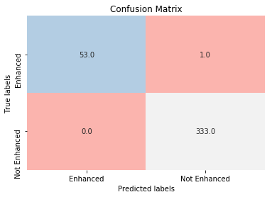

# Digital Facial Enhancement Recognition

## README Contents
 - [Problem Statement](#Problem-Statement)
 - [Executive Summary](#Executive-Summary)
 - [Sample Images](#Sample-Images)
 - [CNN Models and Evaluation](#CNN-Modeling-and-Evaluation)
 - [Conclusion & Future Directions](#Conclusion-&-Future-Directions)
 - [Acknowledgements](#Acknowledgements)

## Problem Statement

Knowing if a face has been digitally enhanced can be difficult in today’s tech-driven world, creating a spectrum of problems that ranges from fake-news to social-media-fueled mental illness. Here, we develop a classification model to predict if a face has been digitally enhanced, whether it be with touch-ups, facial part replacements (i.e nose, eyes, etc.) or shape-correcting edits (i.e. straightening teeth, changing nose size).

## Executive Summary

**Data**

The images of non-photoshopped faces were obtained from the [FEI Face Database](https://fei.edu.br/~cet/facedatabase.html), and it includes 1400 pictures (100 individuals, half female, half male). Different images of the same individual are contained within each modeling set (training, validation and testing sets).

The images of photoshopped faces were compiled from several datasets in order to include different types of enhancements. The first dataset is the [Real and Fake Face Detection Data](https://www.kaggle.com/ciplab/real-and-fake-face-detection/data), where faces are constructed using individual pieces from several faces (faces that people labeled as ‘easy to recognize it is photoshopped’ were excluded). Next, we included images from a Google search of Facetune, since this is the most popular face-editing app used by influencers on social media as well as some celebrities. Both of these photoshopped-face sets together are a total of 791 images, where each individual is unique. 

This gives us a baseline accuracy of 63%. 

All images were standarized and re-sized to 224 x 224. 

We note that the inclusivity level of the dataset could be improved, particularly for non-binary people.

**Models and Results**

Convolutional Neural Networks (CNN) were developed to make this classification. We were able to achieve 100% accuracy by removing the presence of a pooling layer, at the cost of creating a slow model. In turn, we created a second model where a pooling layer was incorporated. It was 6 times faster and had an accuracy of 99%. 

Using the original model, we tested in both RGB and Grayscale to ensure the CNN was not relying solely on color and light but rather the shape of the face. This was necessary because the dataset did not include non-enhanced images with studio lightning (these couldn't be found in large quantities). 100% accuracy was reached again, showing that the model may benefit from color but does not rely on it.

## Sample Images
- *Sample Non-Enhanced Individual*
 

- *Sample Fake Faces*

                    
       

- *Sample Facetuned Faces*

        

## CNN Models and Evaluation

### Model 1 Evaluation

Model 1 was 100% accurate. As mentioned before, we excluded the pooling layer.  The reasoning behind this was that the "skin-blurring" effect (that is almost always present in enhanced faces) and pooling layers both average pixels, undermining the presence of this type of facial edit. 

Below, we can see how the loss and the accuracy fluctuated during training. We also see the confusion matrix for the testing set.

    
    

*Click on the figure for zooming in or out and other interactive features*
  
This confusion matrix was built using the testing set, where we have double the amount of individuals from the enhanced dataset than the non-enhanced dataset. It looks imbalanced because this still makes for a lot more pictures of non-enhanced individuals, but the baseline for all the images is 63%.
  

          

### Model 2 Evaluation

Here, we have a 99% accurate model with 1 false negative. This accuracy is still very good, while the model is 6 times faster.

    

*Click on the figure for zooming in or out and other interactive features*
 

         

### Black and White Test Results

We rebuilt Model 1 in grayscale and obtained the same results. This signals that while the model may pick up different features from RGB channels they aren't necessary for a successful classification. This is particularily important if we want to use the model on pictures with heavy, bright-colored makeup.

           

### Saliency Check

Saliency refers to which pixels stand out in an image. Here, we have a simple saliency map in order to explore what the model is likely to be picking up as important features. Most of what stands out is the skin, confirming the exclusion of the pooling layer was relevant. 

      

With more time, we could map the saliency that our model detects at every layer, as we discuss in the Recommendations section.

## Conclusion & Future Directions

Both of our models predict whether or not a face has been digitally enhanced successfully. **Model 1 does this with 100% accuracy** and a binary cross entropy loss of practically 0, in color or in black and white. This is important because the non-enhanced face pictures' colors were less bright due to the lack of studio lighting, which might not always be the case. **Model 2 reaches 99% accuracy**, and is 6 times faster thanks to the pooling layer. These percentages are well above the **63% baseline**. We could deploy either of these models to detect fake-news that involve placing someone's face on a photograph, or to enable social media users to check who has edited their pictures. 

In the future, we hope to diversify the dataset to make it more inclusive towards non-binary people. We also aim to include other types of facial enhancements, such as plastic surgery, as well as faces created by GANs. 

Moreover, more time would allow us to explore the saliency maps of every layer and determine which areas of each picture stand out as being edited. This could potentially be used to track which edits have been made to which pictures.

## Acknowledgements 
Thank you to everyone at GA for helping me put this project together!